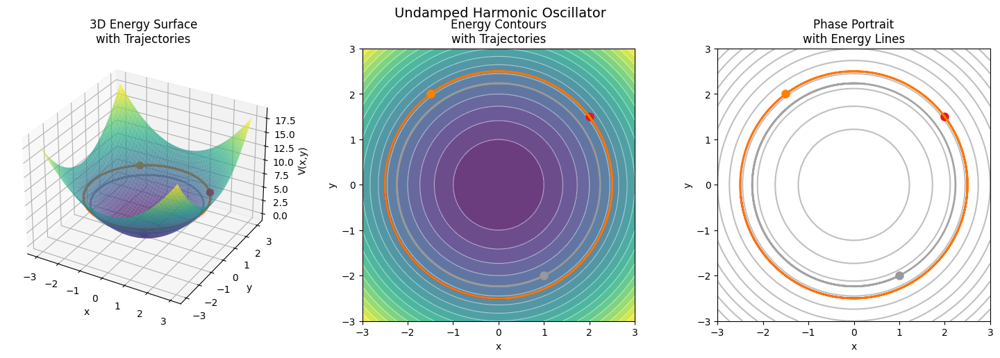
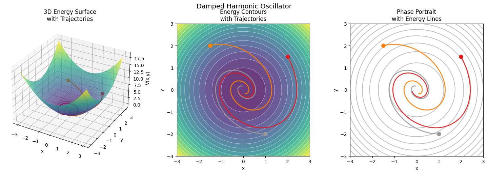
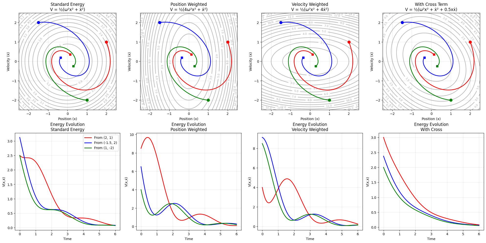

### High-Level Summary

Lyapunov functions refer to Lyapunov's Second Method or Direct Method of studying dynamical systems, introduced by Aleksandr Lyapunov in 1892. This method allows us to make statements about the stability of dynamical systems without explicitly solving the differential equations by introducing a scalar energy-like function known as the Lyapunov function. As long as these functions satisfy certain mathematical conditions and decrease monotonically along system trajectories, we can guarantee that the system will converge to a stable equilibrium. This approach is particularly powerful because it works for both linear and nonlinear systems, providing stability guarantees even when analytical solutions are impossible to obtain.

### Background

A general autonomous dynamical system can be defined by the following relations:

$$
\dot{s} = g(s) \\
g: \mathbb{R}^n \rightarrow \mathbb{R}^n
$$

We refer to this as an autonomous dynamical function since the evolution function, g, is constant with time. The system exists in an n dimensional space and evolves according to the continuously differentiable function g. The system has an equilibrium point at $s^*$ if $g(s^*) = 0$.  For ease of analysis we consider the case where the equilibrium point is at the origin. In fact, for any equilibrium point there exists a coordinate transformation such that the origin is the equilibrium point. 

### Stability of Equilibrium Points

When discussing stability of dynamical systems, we are typically interested in the stability of the system around these equilibrium points. There are typically three classes of dynamic stability we are interested in: 

1) Lyapunov Stability: If we begin near an equilibrium point $s^\ast$  then we stay *near* $s^\ast$

2) Asymptotic Stability: If we begin near an equilibrium point $s^ast$ then we will converge to $s^ast$

3) Exponential Stability: Asymptotic stability with guarantees on the rate of convergence   

Another class of stability we are interested in local vs global stability which differentiate the stability of equilibrium points based on their initial positions. Global stability refers to convergence from any starting point where as local convergence applies to a given neighborhood around the origin. See ‘radial unboundedness’ to learn more about global stability. 

### Lyapunov’s Second Method for Stability or Lyapunov’s Direct Method

The power of Lyapunov functions is in their ability to make statements about equilibrium stability from relatively simple definitions. A Lyapunov function is defined as a continuous scalar function $V: \mathbb{R}^n \rightarrow \mathbb{R}$ with continuous first derivatives that satisfies the following conditions:

- $V(x) = 0$  iff $x = 0$
- $V(x) > 0$  iff  $x\neq  0$
- $\dot{V}(x) = \frac{dV}{dx} \frac{dx}{dt} =  \nabla V \cdot g \leq 0$ for $x \neq 0$

Any function that obeys these conditions is considered a Lyapunov function and this further guarantees that the system is Lyapunov stable! If we strengthen the derivative condition to be strictly negative then the system is asymptotically stable. Pretty neat! The tricky-ness with Lyapunov analysis is defining a the function for complex dynamical systems.  

### Harmonic Oscillator

Let’s consider the harmonic oscillator as an example. We have a mass-spring system with spring constant k. From Newton’s second law we know that force experienced by our mass is proportional to the position of our mass and the spring constant k. 

$$
F = ma = m \ddot{x} = -kx
$$

We define our state space, $s = [x, y]$, with dynamics as follows: 

$$
\frac{dx}{dt} = y
$$
$$
\frac{dy}{dt} = - \frac{k}{m} x = -\omega^2 x
$$

We use the canonical $\omega = \sqrt{k/m}$. We can represent this motion as a linear dynamical system:

$$
\frac{ds}{dt} = \begin{bmatrix} 0& 1 \\\  -\omega^2 & 0 \end{bmatrix} \begin{bmatrix} x \\\ y \end{bmatrix} = \begin{bmatrix} y \\\ - \omega^2 x\end{bmatrix} 
$$

Let’s consider the following Lyapunov function (hey its the total energy of the system!) We scale by mass for simplicity here. 

$$
V(s) = \frac{K.E + P.E}{m} = \frac{1}{2}y^2 + \frac{1}{2} \frac{k}{m} x^2 = \frac{1}{2} (y^2 + \omega^2 x^2)
$$

How does this function satisfy the necessary conditions for the Lyapunov function? 

- $V(s) = 0$  iff $s = 0$ : This is clearly true since our position and velocity are real numbers
- $V(s) > 0$  iff  $s\neq  0$ : Since we are dealing with sums of squares this is also true.
- $\dot{V}(s) = \frac{dV}{ds} \frac{ds}{dt} =  \nabla V \cdot g \leq 0$ for $s \neq 0$

$$
\dot{V}(s) = \begin{bmatrix}
 \omega^2 x \\\ y
 \end{bmatrix} \cdot \begin{bmatrix} 
y \\
- \omega^2 x \\\
\end{bmatrix} = 0
$$

Notice that in our undamped system the derivative of the Lyapunov function is 0. This implies that the system is Lyapunov stable, but not asymptotically stable. The physical interpretation of this is that the system does not dissipate energy and continuously oscillates with constant amplitude. If we had a damping term in our equation of motion then we would find that the derivative of the Lyapunov function is strictly negative implying asymptotic stability. Notice here that conservative systems are Lyapunov stable whereas dissipative systems are asymptotically stable! 

We can visualize the trajectories taken. In the case of the Undamped harmonic oscillator we see that the system stays in the energy level set corresponding to its initial trajectory. 

In the damped harmonic oscillator case we can see that the system converges towards the stable equilibrium point at the origin! Notice how this the points move towards the low energy valley much like a ball finding its resting spot in a bowl. 

### Discussion of Lyapunov Function Variations

You may have noticed that there can be multiple Lyapunov functions for a given system. In the example above, we scaled down the true total energy by the mass, but we could have equivalently weighted various variables differently in our Lyapunov function. Different Lyapunov functions give us different representations of the system. Below we define 3 variations of the Lyapunov function defined above.

Notice that the trajectories are unchanged, however, the values of the energy function at each position is modified by the variation. In weighting position over the velocity we effectively stretch the energy level sets along the velocity axis. We now see different basins of attraction based on the variations of the Lyapunov function; however, the underlying stability is unchanged. One way to think of multiple Lyapunov functions for the same system as different tools to probe the underlying stability dynamics. The ground truth remains the same, but we get some observation noise based on what is prioritized by the Lyapunov function. These differences also appear in the energy evolution of the system. 

### Quadratic Form Lyapunov Functions for Linear Dynamical Systems

Now that we understand how beautiful Lyapunov functions are, what’s stopping us from using them everywhere? In short, the more complicated our system gets the harder it is to define appropriate Lyapunov functions. Luckily, there is a beautiful way to write Lyapunov functions for linear dynamical systems. In particular, quadratic forms lend themselves very well to defining Lyapunov functions for linear systems. 

Consider an arbitrary linear dynamical system given by the following differential equation:

$$
\frac{dx}{dt} = Ax
$$

Let’s define our Lyapunov function as a quadratic form 

$$
V(x) = x^T Px
$$

where P represents a positive definite matrix. If we consider the Lyapunov conditions:

- $V(x) = 0$  iff $x = 0$ : Satisfied by positive definite matrix
- $V(x) > 0$  iff  $x\neq  0$ : Satisfied by positive definite matrix
- $\dot{V}(x) = \frac{dV}{dx} \frac{dx}{dt} =  \nabla V \cdot g \leq 0$ for $x \neq 0$

$$
\dot{V}(x) = \frac{dx^T}{dt} Px + x^T P \frac{dx}{dt} = (Ax)^T P x + x^T P Ax = x^T (A^T P + P A) x
$$

If this is equal to $-Q$ for some positive definite matrix, Q, then we have a valid Lyapunov function! This is known as the Lyapunov Equation.

$$
A^TP + AP + Q = 0
$$

For any stable system, A , there exists a unique solution P  > 0  for any Q > 0. In practice, this means that we can set Q to I and solve for P to find a single Lyapunov function. For a given pair of P and Q, we can interpret the values $x^TPx$  as the generalized energy of the system and $x^T Qx$ as the generalized dissipation. We can think of P as the generalized energy of the system since it is how define the ‘energy’ of the system. Q is the dissipation term since it is equivalent to the interactions between the energy of the system, P, and the dynamics of the system, A. Since the energy is decreasing over time, proportional to Q we can think of it as dissipation. 

### Theorems

For systems that obey the Lyapunov equation, we get the following theorems. These are a subset of the theorems on Boyd’s Linear Quadratic Lyapunov Theory page.

- If $P > 0, Q >0$ (both positive definite) then the system is globally asymptotically stable
- If $P > 0, Q \geq 0$ then all trajectories of the system are bounded
- If A is stable, there exists a quadratic Lyapunov function V(x) that proves it.
    - There exist P > 0, Q >0 for that satisfy the Lyapunov equation
- If A is stable and $Q \geq 0$, then $P \geq 0$

  

### Connection between Spectral Analysis and Quadratic Forms

In a linear dynamical system, the behavior of the system can be understood through the lens of the eigenvalues of A. 

$$
\frac{dx}{dt} = Ax \Rightarrow x(t) = x(0) e^{At}
$$

Solutions to this differential equation can be given by the sum of exponentials of eigenvalues and their corresponding eigenfunctions. 

$$
x(t) = \sum_i^n c_i e^{\lambda_i t} x_i
$$

You can think of this as decomposing the dynamics into modes corresponding to the eigenvector. The time evolution of each mode is given by the eigenvalues. The real component of each eigenvalue $\lambda_i$  corresponds to the amplitude of the mode while the complex portion refers to the phase shift. Modes with negative eigenvalues decay towards 0. The smaller the value the slower the mode decays so the limiting behavior of the system is given by the real eigenvalue closest to 0.  This is the machinery we typically use to solve linear ODEs. 

When we think of a Lyapunov function for this system, we are concerned with the Lyapunov equation which gives us $-Q = A^T P + P A$. The values of our energy function are given by the eigenvalues of A. In fact, when we think of the quadratic form $V(x) = x^T P x$ we are effectively computing a weighted euclidean distance where the weights correspond to the eigenvalues of P. Since the value of P are determined by the eigenvalues of A, we are effectively weighting our energy function in accordance to the eigenvalues of our matrix A. We can see this idea explicitly when considering the time evolution of the energy function:

$$
V(x(t)) = x(0)^Te^{A^Tt} P x(0) e^{At} = x(0)^T P(t) x(0)
$$

We move the time dependence of the energy function into the evolution of P. Each cross term in this matrix decays according to the eigenvalues $\lambda_i + \lambda_j$. In a stable system we have that the Real portions of each eigenvalue must be negative. This also implies that the P(t) operator decays towards 0. Therefore, $V(x(t)) \rightarrow 0$. Quadratic forms allow us to capture cross terms in the decay rates of individual modes of the system. You can think of the cross terms as allowing us to capture the energy transfer across modes. In eigen-coordinates we would not need these terms; however, since we are working in standard coordinates we must account for interactions between modes.  

### Limitations of Lyapunov Functions

- The main limitation of the Lyapunov function approach to understanding dynamical systems is actually finding the functions themselves. There exist some algorithms to find functions under specific conditions, but there is no general method to define them.
- Lyapunov functions are fundamentally local tools. They are able to explain stability in the local region in which they are appropriate. This can cause issues when studying systems with differing stability behavior in different regions around the stable point *ie. bifurcations.* This also presents issues when studying systems with multiple equilibria and oscillatory systems.
- Extensions into time-dependent and stochastic systems exist but are complex

### Further Reading

- Foster-Lyapunov Theorem
- LaSalle Invariance Principle
- Sum Of Squares Method: Computational method to find Lyapunov functions

### Some helpful resources I used along the way

- https://underactuated.mit.edu/lyapunov.html
- https://www.cds.caltech.edu/~murray/courses/cds101/fa08/pdf/L2-2_lyapunov.pdf
- https://stanford.edu/class/ee363/notes/lq-lyap-notes.pdf